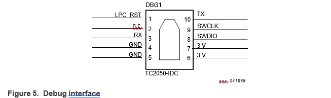
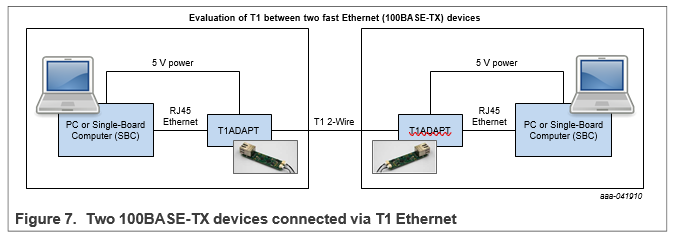

##  RDDRONE-T1ADAPT 100BASE-T1 to 100BASE-TX media Converter

### 1. Introduction

The RDDRONE-T1ADAPT Ethernet adapter board is intended to be used as a platform for evaluating the use of T1 Ethernet in a variety of application areas. This network media converter allows 100BASE-T1 automotive devices and devices with traditional 100BASE- TX incorporating an RJ45 connector to be combined in a single network. This document is the user guide for the RDDRONE-T1ADAPT 100BASE-T1 to RJ45 adapter board. It describes how to use the board to connect a standard 100BASE-TX Ethernet interface to a T1 node or T1 network switch. It also describes how a pair of boards can be used to allow two remote RJ45 nodes to communicate via a reliable two-wire T1 interface by translating 100BASE-TX nodes to 100BASE-T1 and back again to 100BASE-TX.

This release of the adapter board supports 100 Mbit/s links on the RJ45 and T1 connectors. Automatic mode detection is enabled on the T1 connectors, so no further adjustments are needed.
.

### 2. Finding kit resources and information on the NXP website
NXP Semiconducutors provides online resources for this media converter at http://www.nxp.com/RDDRONE-T1ADAPT. This README provides a quick-reference to use the RDDRONE-T1ADAPT along with links to downloadable assets. Additional information can be found at http://nxp.gitbook.io/rddrone-t1adapt.
 
#### 2.1 Collaborate in the NXP community
The NXP community is for sharing ideas and tips, asking and answering technical questions, and getting input on just about any embedded design topic.

The NXP community is at https://community.nxp.com. A dedicated robotics community can be found at https://community.nxp.com/community/mobilerobotics.

### 3. Kit contents
- 24 The RDDRONE-T1ADAPT kit contains:
•	PCB board
•	1 x 2-wire T1 Ethernet cable with JST-GH connector
•	1 x 3-pin (2-wire) power cord with JST-GH connector

### 4. Overview of the RDDRONE-T1ADAPT media converter
The RDDRONE-T1ADAPT Ethernet adapter board is an evaluation platform for automotive two-wire Ethernet (100BASE-T1). It can be used to connect a standard Ethernet device, such as a PC or single-board computer, to a peripheral device with a T1 Ethernet interface. Two RDDRONE-T1ADAPT boards can be used to connect two standard Ethernet devices together via a T1 network. Top and bottom views are shown in Figure 2. Software source code is available on request through NXP sales if the user needs to modify the configuration. However, the board is preprogrammed and designed for plug-and-play operation with no additional software needed.

#### 4.1 Block diagram
A block diagram of the RDDRONE-T1ADAPT media converter is shown in Figure 3.

#### 4.2 Main Components 
The main components on the RDDRONE-T1ADAPT board are highlighted in Figure 4 and discussed briefly in the following sections.

##### 4.2.1 TJA1101B (1)
The TJA1101B 100BASE-T1 automotive Ethernet PHY from NXP Semiconductors is used to support the automotive Ethernet (T1) side of the media converter. The TJA1101B offers 100 Mbit/s transmit and receive capability over an unshielded twisted pair (UTP) cable of up to at least 15 m [1].

##### 4.2.2 100BASE-TX PHY (2)
The 100BASE-TX Ethernet PHY supports the standard Ethernet side of the media converter.

##### 4.2.3 LPC812 (3)
The ARM Cortex-M0+ micro is used to configure the two back-to-back PHYs and to control the master/slave behavior of the TJA1101B [2]

##### 4.2.4	Debug connector (4)

This debug interface, illustrated in Figure 5, can be used to program the device. Since a physical connector is not mounted on the board, a cable such as the TC2050-ID-NL illustrated in Figure 6 can be used to interface with the board via the debug interface. Note that the board is designed for plug-and-play and does not need to be configured for evaluation purposes. The source code is available on request for users that need to adjust the configuration.

Note: While the interface accepts standard SWD debugger signals, this is not a standard JTAG/SWD pinout. UART signals have also been included for debugging purposes. A custom wiring or board adapter will need to be configured in order to connect to a traditional JTAG/SWD debugger.

##### 4.2.5	LEDs
A number of status LEDs are provided:
- A green power LED that lights up when power is supplied to the board.
- Two red T1 status LEDs: 'inner' and 'outer' (see Figure 2). A stable T1 connection has been established between the two on-board PHYs when the 'inner' status LED is flashing and the 'outer' status LED is solid on.
- Two green LEDs on the RJ45 connector. An RJ45 connection has been established when the Data status LED is flashing and the Link status LED is solid on.

##### 4.2.6 Connectors
Four physical connectors have been mounted on the board:
- A 3-pin JST-GH power connector
- A 2-pin 100BASE-T1 Ethernet connector
- A standard RJ45 Ethernet connector
-	A standard Micro USB connector (mounted on the bottom of the board; see Figure 2)

### 5	Power supply
The RDDRONE-T1ADAPT board needs an external 5 V supply. The 5 V supply can be provided by a PC or laptop via the USB connector on the bottom of the board, or via a 3-pin JST-GH power cord. Note that the USB connector is only used to provide the 5 V supply; there is no actual USB data communication. The 3-pin connecter can be used with a single-board computer or NavQ/PX4 device (pin 1 = 5 V; pin 3 = GND).

### 6	System configurations
The RDDRONE-T1ADAPT is designed to interface between standard 100BASE-TX Ethernet and two-wire automotive Ethernet in order to evaluate T1 performance. A number of system configurations are possible.
- Note: T1 Ethernet is designed to be used with unshielded cable lengths <15 meters
 
#### 6.1 Evaluating T1 between two 100BASE-TX devices

In Figure 7, a pair of RDDRONE-T1ADAPT boards are used to connect two standard PCs with RJ45 connectors together over a 2-wire T1 network. The adaptors communicate with each other via T1 and the power is supplied by the PCs over USB cables

#### 6.2 Evaluating communication between a TX and a T1 device

In Figure 8, an RDDRONE-T1ADAPT is used to connect a PC or single-board computer to a T1 peripheral. In this configuration, the power may be supplied through the 3-pin JST-GH connector with 5 V power coming from a pin header or matching connector on the single-board computer

#### 6.3 Connecting a 100BASE-TX device to a T1 network switch
In Figure 9, an RDDRONE-T1ADAPT is used to connect a PC or single-board computer to T1 network switch (such as RDDRONE-T1ETH8).

### 7  LPC programming methods
Use any one of the common LPC programming methods to flash the software to the board.
Following are some of the methods - 
#### 7.1 Flash Magic 
- Note : Use instructions given in below link 
https://community.nxp.com/pwmxy87654/attachments/pwmxy87654/lpc%40tkb/201/3/Flash%20Magic%20programming%20LPC.pdf

#### 7.2 Flash Using MCUxpresso 
- Note : Use instructions given in below link
https://community.nxp.com/pwmxy87654/attachments/pwmxy87654/Layerscape/4742/1/MCUXpresso_IDE_User_Guide.pdf

### 8. Device Operation
Once the RDDRONE T1ADAPT and peripherals have been connected and powered up, the firmware alternates which adapter device is the dominant controller on the T1 bus until a stable connection is established. In the absence of a signal, the firmware resets the PHYs and tries again to establish a link.

### 9. Refreneces
- [1] TJA1101B 100BASE-T1 PHY for automatove Ethernet, https://www.nxp.com.
- [2] LPC812 ARM Cortex-M0+ microcontroller, https://www.nxp.com